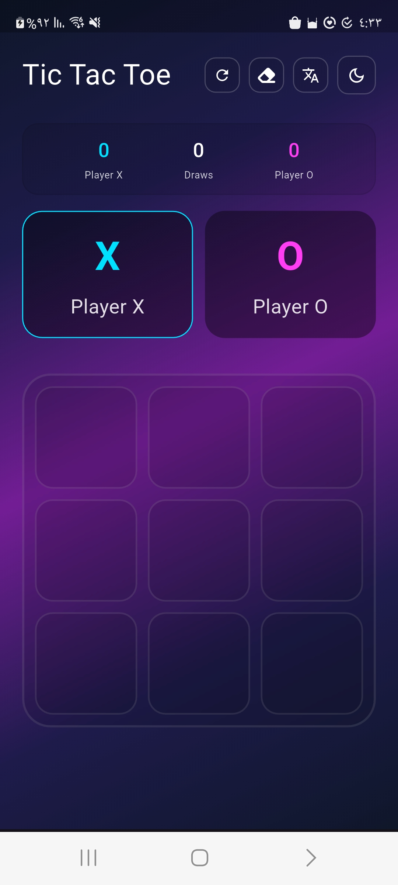
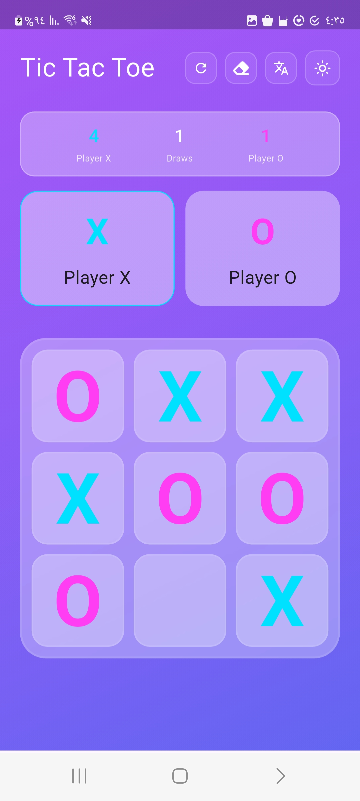
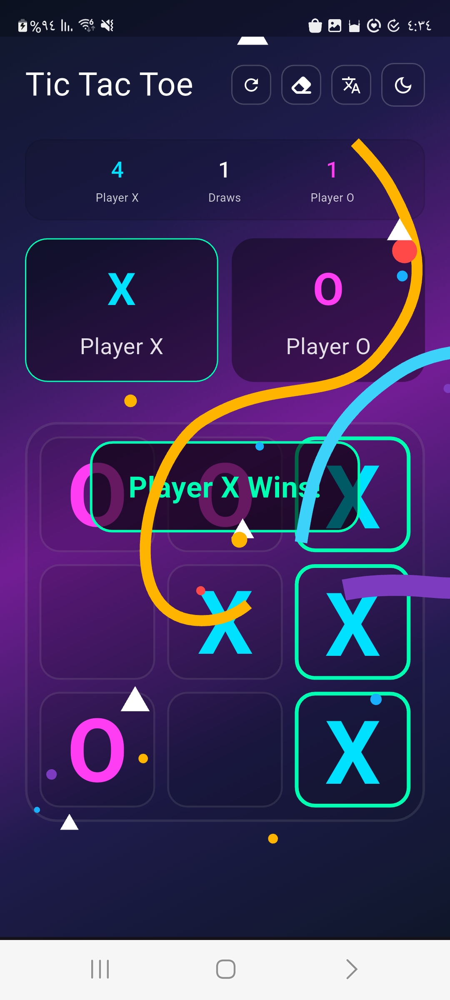

# 🎮 Tic Tac Toe - Flutter Game

A simple and interactive Tic Tac Toe game built using Flutter. This project demonstrates a clean, responsive UI, interactive animations, and full game logic.

---

## ✨ Features

- 🔄 Two-player mode (X & O)  
- 🧠 Win & draw detection  
- 🎉 Win overlay with confetti animation  
- 🏆 Score tracking for each player  
- 🌙 Light / Dark mode toggle  
- ⏱ Timed game messages  
- 📱 Responsive & adaptive UI 

---

## 🛠 Tech Stack

- Flutter  
- Dart  

---

## 📦 Packages Used
 - font_awesome_icon_class (Icons for UI controls)
 - lottie (Animated win)

---

## 📸 Screenshots & 🎥 Video

Below are some images and a short demo video of the game.

| 🌙 Dark Mode | ☀️ Light Mode | 🎉 Celebration animation |
|-------------|---------------|---------------------------|
|  |  |  |

### 🎥 Gameplay Demo

https://github.com/user-attachments/assets/e88ba936-0c91-49aa-9b1d-5d7bbe152013

---

## ⚙️ Setup & Installation
1. Clone the repository: `git clone https://github.com/manhal203/flutter-tic-tac-game.git`
2. Install dependencies: `flutter pub get`
3. Run the app: `flutter run`
